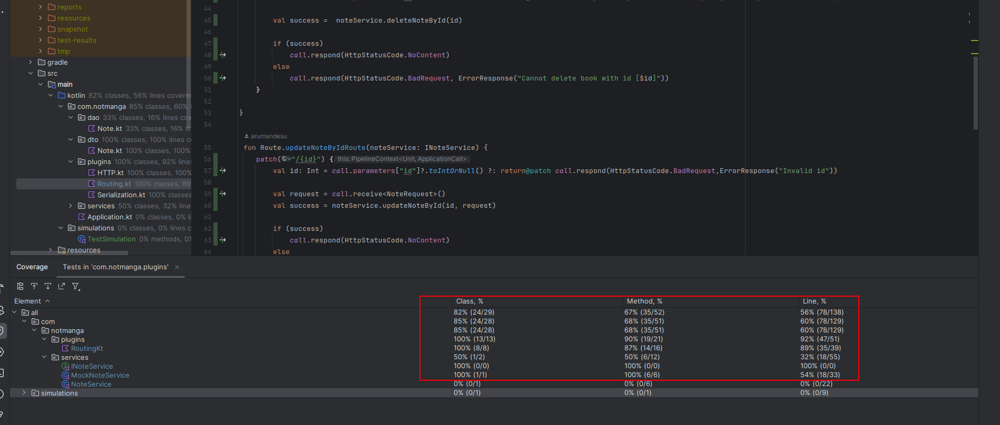

# Unit test
Unit tests help ensure that individual functions or methods of your code work as expected in isolation.
### Example:
```kotlin
// Assume a simple Calculator class
class Calculator {
    fun add(a: Int, b: Int): Int {
        return a + b
    }
}

// Unit Test
fun testAddition() {
    val calculator = Calculator()
    val result = calculator.add(3, 4)
    assert(result == 7)
}

```

# Integration test
Integration tests verify that different components or modules of your system work together correctly.
Also you can use mock some objects to isolate them and prevent changes of them
### Example:
```kotlin
// Assume a CRUD service with methods for creating and retrieving data
class CrudService {
    fun createRecord(data: String) {
        // Implementation
    }

    fun getRecord(id: Int): String {
        // Implementation
    }
}

// Integration Test
fun testCrudOperations() {
    val crudService = CrudService()
    crudService.createRecord("Test Data")
    val retrievedData = crudService.getRecord(1)
    assert(retrievedData == "Test Data")
}

```

# Stress testing
Stress testing evaluates how well your system handles extreme conditions or workloads.
You can use [Apache JMeter](https://jmeter.apache.org/) or [Gatling](https://gatling.io/) and etc.

# Smoke testing
Smoke testing checks the basic functionality of your application to ensure it runs without critical errors.
Smoke test runs before more extensive testing.
---
I think that smoke test is not necessary for this crud app, no where to place.
Because smoke testing checks the basic functionality of your application to ensure it runs without critical errors.
